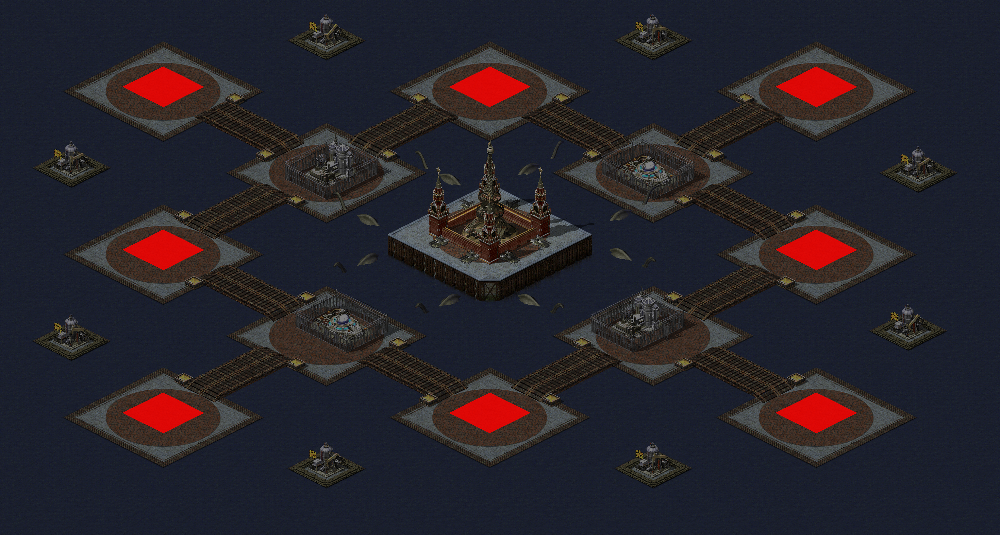

# Tiny land

- Players: 2-8
- Size: small
- Environment: Urban, Thunderstorm
- Resource: Middle (oil derricks only)

## Preview

## Features

- Every one starts with an oil derrick
- Oil derricks are immunue, it can only be captured
- At least 8 crates in the map
- Construction Yard provides the global vision (like SpySat)
- Einstein Laboratory and Time Machine are immunue, it can only be captured
  - Need 400 power to work
  - Provide 2 Superweapons: Chronosphere & Iron Curtain
- Eiffel Tower in the center
  - Hide radar sight nearby (like Gap Generator)
  - If destroyed,
    - A Weather Storm will strik at the rubble immediately
    - There will be random Weather Storm at any land periodically.
  - If captured,
    - Can be charged like Tesla Coil, then it can fire on most of the map
    - Can build Volkov
      - Volkov has the strong electric bolt weapon
      - Volkov can charge Tesla Coil or Eiffel Tower

## Tips

- Since every one start on a tiny land, you should invade your neighbor as soon as possible to get more space for development
- You should carefully plan your buildings to avoid traffic jam
